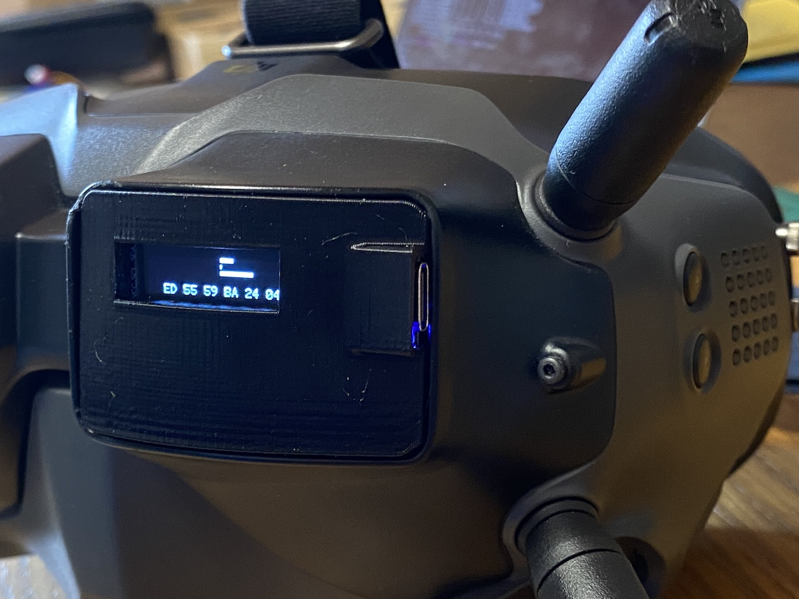
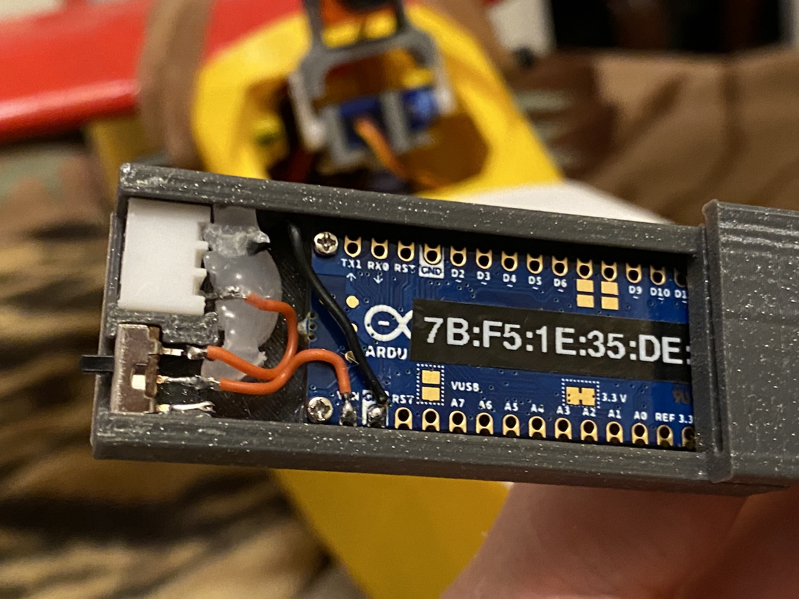

# Head Tracker

Head Tracker runs on [Arduino Nano 33 BLE](https://store.arduino.cc/arduino-nano-33-ble) and [Seeeduino XIAO BLE Sense](https://www.seeedstudio.com/Seeed-XIAO-BLE-Sense-nRF52840-p-5253.html) boards and connects wirelessly via Bluetooth to [OpenTX](https://github.com/opentx/opentx) radios.

Listed boards are perfect for head tracker project, since they have both **IMU** for orientation and **Bluetooth** for connectivity.

This project switched to Go language ([TinyGo](https://tinygo.org) compiler) from classic Arduino C/C++ that had been archived in [arduino](https://github.com/ysoldak/HeadTracker/tree/arduino) branch.

<table>
<tr><td>

</td><td>

</td></tr>
<tr><td>

</td><td>

</td></tr>
</table>

## Tested radios
- FrSky X-Lite Pro (OpenTX)
- FrSky X20S Tandem (EthOS)

## Connect to head tracker
- Flash your board with a release file
- Connect to the board with a **Serial console** and make note of the board **address** (like: `7b:f5:1e:35:de:94`)
- SSD1306 LED display can be connected (via I2C) to the board; in such case board address displyed there too
- In your radio, select Trainer mode **"Master/BT"**, wait a bit and click "[Discover]"
- Search for your board by address you noted earlier and **Connect** to it
- **Blue led** on the board shall turn **on** indicating successful connection
- Do not forget to configure **Trainer function** in your radio either on "Special Functions" screen of your model or on "Global Functions" of your radio setup.

## Related links
- [DIY-Head-Tracker](https://github.com/kniuk/DIY-Head-Tracker)  
  Original DIY head tracker for Arduino Nano with separate IMU board and PPM over cable
- [RC HeadTracker by Cliff](https://github.com/dlktdr/HeadTracker)  
  Another, more advanced version of head tracker, also based on Arduino Nano 33 BLE board.
- [Bluetooth Smart/BLE Crash Course](https://inductive-kickback.com/projects/bluetooth-low-energy/bluetooth-smartble-crash-course/)
- [Bluetooth low energy Characteristics, a beginner's tutorial](https://devzone.nordicsemi.com/nordic/short-range-guides/b/bluetooth-low-energy/posts/ble-characteristics-a-beginners-tutorial)
