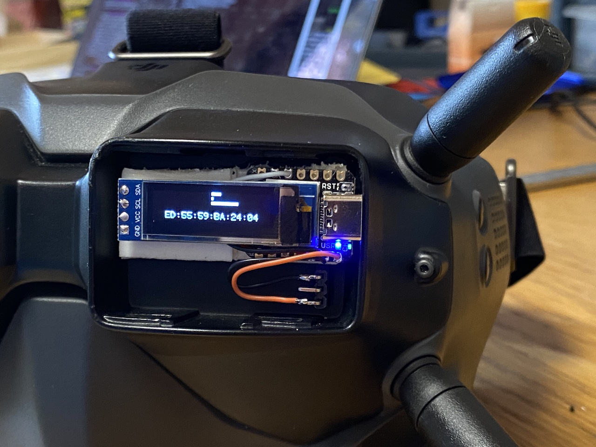
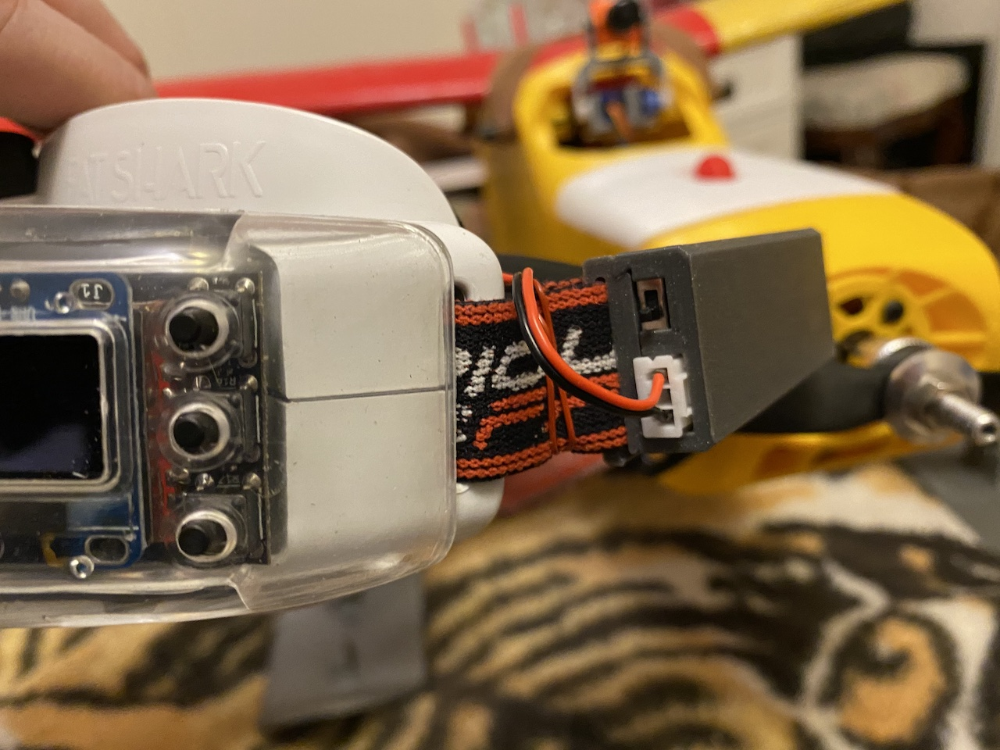
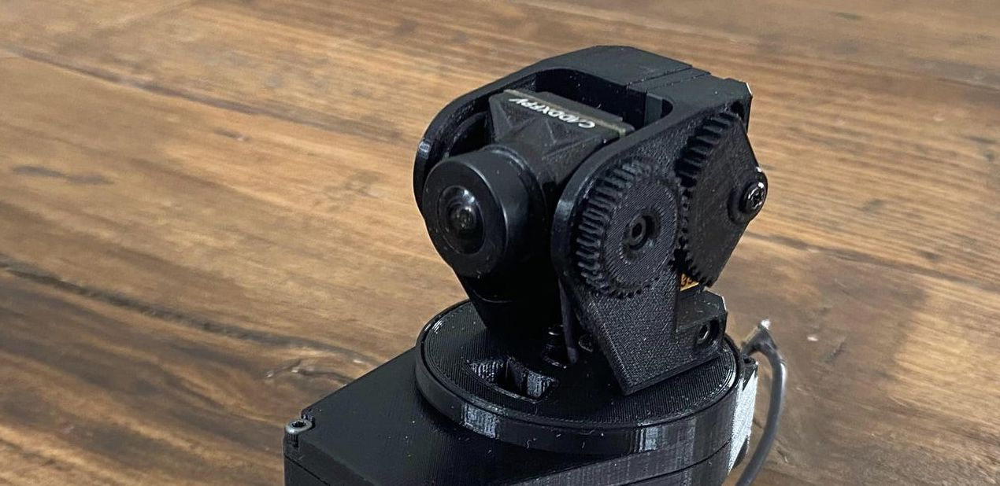
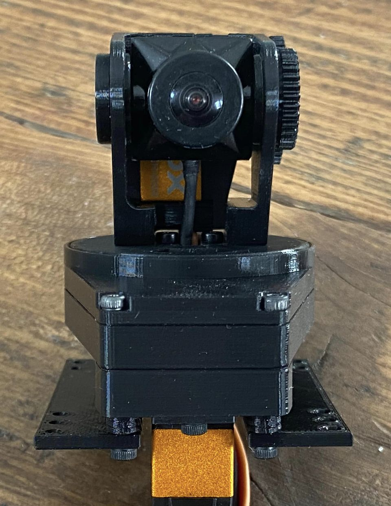
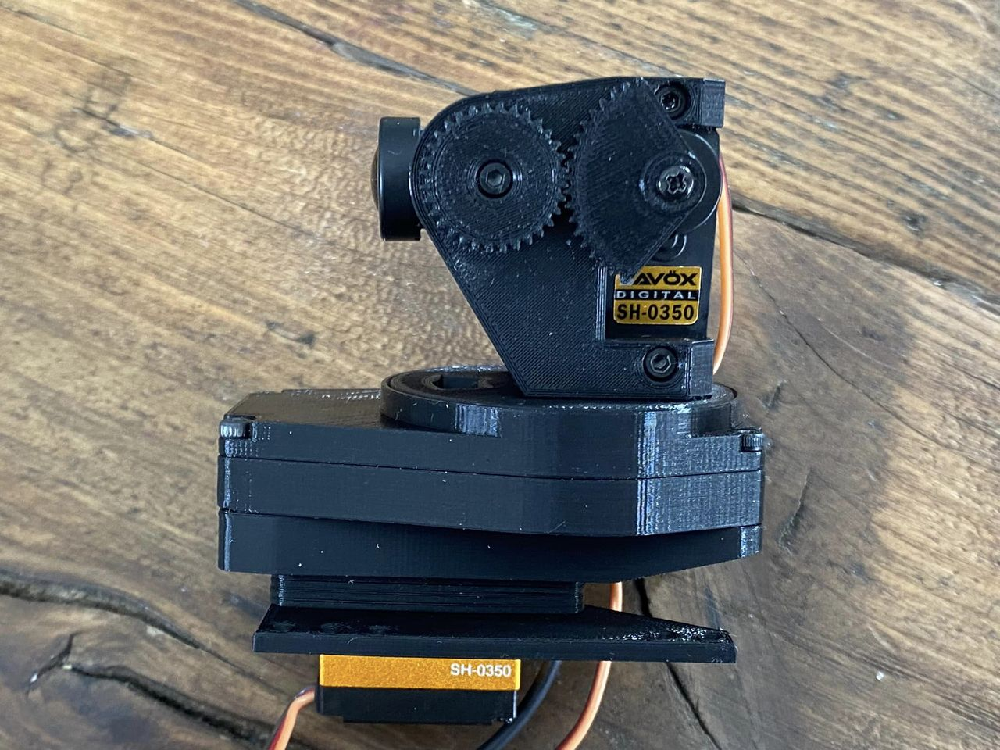
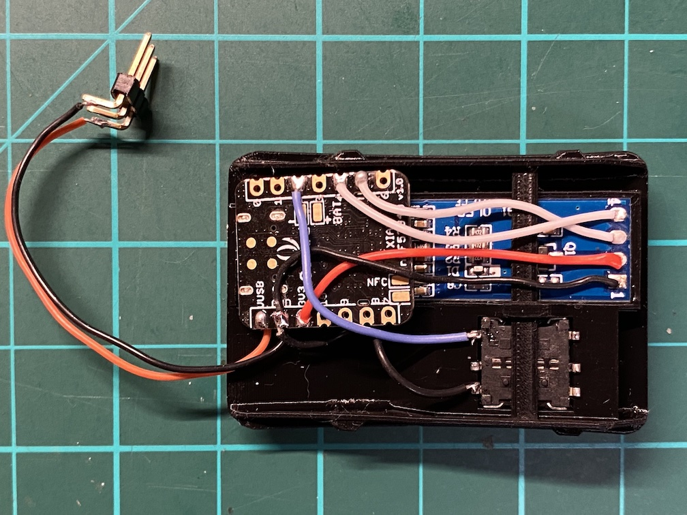

# Zero configuration auto-calibrating DIY head tracker

Head Tracker runs on [Arduino Nano 33 BLE](https://store.arduino.cc/arduino-nano-33-ble) and [Seeeduino XIAO BLE Sense](https://www.seeedstudio.com/Seeed-XIAO-BLE-Sense-nRF52840-p-5253.html) boards and connects to [OpenTX](https://github.com/opentx/opentx) and [ETHOS](https://ethos.frsky-rc.com) radios.  
Both wired (PPM) and wireless (Bluetooth) trainer connection modes are supported.

<table>
<tr><td>

</td><td>

</td></tr>
<tr><td>

</td><td>

</td></tr>
</table>

## Camera Gimbal
Check our DIY 3D printed [Micro Camera Gimbal](https://cults3d.com/en/3d-model/gadget/micro-camera-gimbal-ysoldak)  
Join our dedicated [Facebook group](https://www.facebook.com/groups/242161055041994)
<table>
<tr><td colspan="2">

</td></tr>
<tr><td>

</td><td>

</td></tr>
</table>

## Tested radios
- FrSky X-Lite Pro (OpenTX)
- FrSky X20S Tandem (EthOS)

## Wiring reference
- **D2**: Orientation reset pin, use button that connects this pin to **GND**
- **D8**: PPM mode activation pin, solder permanently or use positional switch to connect this pin to **GND**
- **D10**: PPM signal pin, connect to audio jack tip and **GND** to jack body
- **SDA&SCL**: I2C communication pins, connect them to 128x32 SSD1306 screen

## Supported boards

Listed boards are perfect for a head tracker project, since they have both **IMU** for orientation and **Bluetooth** for connectivity.

**XIAO BLE Sense** is a tiny board with UF2 bootloader and SoftDevice (bluetooth driver) pre-flashed that makes it very easy to use.
The board is relatively new and may be harder to find. Please pay attention and order "Sense" variant, it has IMU.  
_Recommended for users w/o experience in embedded programming._

**Nano 33 BLE** is a larger board from Arduino that shall be easier to source. There are two variants of this board: "Nano 33 BLE" and "Nano 33 BLE Sense" -- both will work for this project. This board has no UF2 bootloader pre-flashed and a debug probe is required to flash UF2 bootloader to it.  
_Recommended for advanced users who have a debug probe (JLink or CMSIS-DAP compatible) and can use it._

For a long time, Nano 33 BLE was the only board supported. It has an additional sensor, magnetometer, that head trackers usually use to eliminate yaw drift. In practice, however, magnetometer adds more problems than solves. Magnetometer is very sensitive to environment and tricky to calibrate properly. In this project we do not use magnetometer and have a good zero-configuration automatic continuous gyro calibration instead to solve the drift problem. Already after first 5 seconds the calibration is good enough to stop the drift.  

As of now, Nano 33 BLE board does not provide any benefit over XIAO BLE Sense. Instead, the later board is actually easier to use, thanks to pre-flashed UF2 bootloader and smaller size. In the future, just for fun, magnetometer support can be added but only if we can make calibration automatic and transparent for the user.

You have another nRF52840-based board with IMU and want to use it? File a feature request. Better yet, make a PR directly!

## Flash binary

### XIAO BLE Sense (Simple)
Connect the board to your computer, double-tap on RST button and copy `ht_xiao-ble_xxx.uf2` file to XIAO-SENSE usb drive.

### Nano 33 BLE (Advanced)
First, you shall [flash UF2 bootloader to the board](./doc/Nano33BLE.md). You only need to do this once for each new board.
Then connect the board to your computer, double-tap on button and copy `ht_nano-33-ble_xxx.uf2` file to NANO33BOOT usb drive.

## Use head tracker
Attach the board with flashed head tracker code to your FPV goggles.  
Place your goggles on a solid surface and power the head tracker with 2 cell battery or 5v source. I use analog adaptor bay on my DJI goggles to source 5v. 

### LEDs
On start, board shall blink continuously blue, red and green/orange leds.
- Blue led indicates Bluetooth state and blinks while not connected, it switches to solid blue upon successful connection to your radio (see below);
- Red led indicates initial gyroscope calibration, you shall wait until the red led is off before use, normally no more than several seconds;
- Green/orange led indicates health of the head tracker and shall slowly blink during normal operation.

### Buttons
The head tracker records initial orientation on power up, place your goggles accordingly.  
Optionally, a **reset orientation** button can be wired to **D2** and **GND** pins.

### Screen
If you have a LED 128x32 screen added you your board (via I2C), the board's bluetooth address is displayed on it. Blinking ":" symbols indicate bluetooth connection status, like blue led. Upon start, while gyroscope is calibrating, you shall see head tracker version briefly on the screen. The version is then replaced by 3 horisonal bars, one for each axis: roll, pitch and yaw.

## Connect to radio

HeadTracker can work either in wireless (Bluetooth) or wired (PPM) mode.  
Bluetooth mode is active by default.

### Bluetooth
- Flash your board with a release file
- Connect to the board with a **Serial console** and make note of the board **address** (like: `7b:f5:1e:35:de:94`)
- [SSD1306 LED display](https://www.amazon.com/s?k=ssd1306+128x32+oled+i2c) can be connected (via I2C) to the board; in such case board address displyed there too
- In your radio, select Trainer mode **"Master/BT"**, wait a bit and click "[Discover]"
- Search for your board by address you noted earlier and **Connect** to it
- **Blue led** on the board shall turn **on** indicating successful connection
- Do not forget to configure **Trainer function** in your radio either on "Special Functions" screen of your model or on "Global Functions" of your radio setup.

### Wire
- Activate PPM trainer output by connecting **D8** and **GND** pins.
- Collect PPM signal from **D10** pin. (Audio jack tip shall be connected to **D10** and rest to **GND**)

## Related links
- [DIY-Head-Tracker](https://github.com/kniuk/DIY-Head-Tracker)  
  Original DIY head tracker for Arduino Nano with separate IMU board and PPM over cable
- [RC HeadTracker by Cliff](https://github.com/dlktdr/HeadTracker)  
  Another version of head tracker, based on Arduino Nano 33 BLE board.
- [Bluetooth Smart/BLE Crash Course](https://inductive-kickback.com/projects/bluetooth-low-energy/bluetooth-smartble-crash-course/)
- [Bluetooth low energy Characteristics, a beginner's tutorial](https://devzone.nordicsemi.com/nordic/short-range-guides/b/bluetooth-low-energy/posts/ble-characteristics-a-beginners-tutorial)
