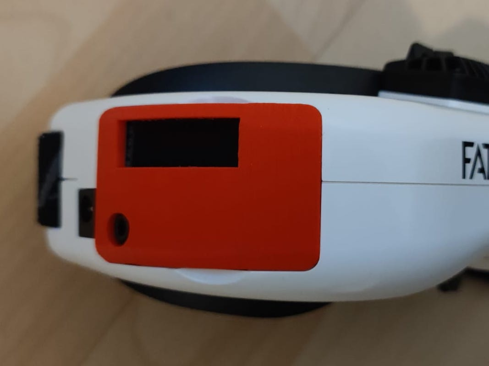
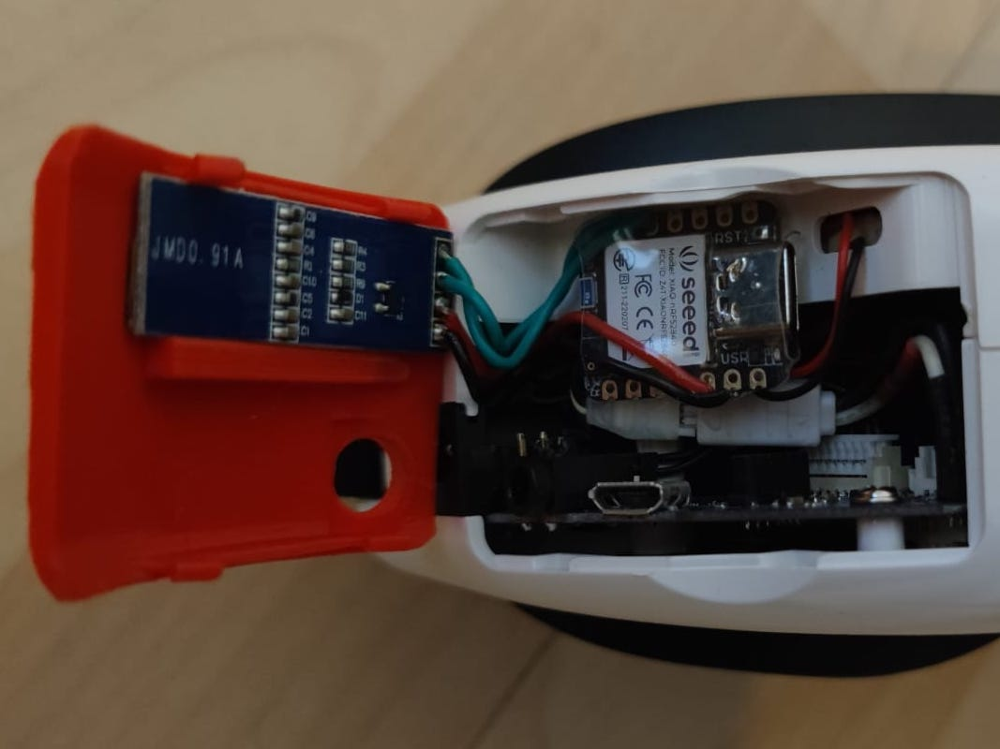

## Xiao BLE Sense

The cases designed for Xiao BLE Sense board and SSD1306 128x32 display.  

### BDI Adapter

Head tracker receives power from analog bay.

Print `BDI Adpater Xiao Ble Case.stl` standing on USB-C connector hole side.  
Use double-size tape or a drop of rubber glue to attach the display to Xiao BLE.  
Place carefully little 3D printed boot button into respective place.  
Insert USB-C of Xiao BLE to respective hole and press the display in place.  
Press [Five Directions Navigation Button](https://www.amazon.se/gp/product/B07QM88HP2) into opening.  
Use `BDI Adpater Xiao Ble Lock.stl` to secure button and display.  
Insert power pins into analog bay connectors and insert the case into BDI adapter.

<table>
<tr><td>

</td><td>

</td></tr>
</table>

### Walksnail Goggles X

Head tracker uses 1S battery for power.

Print `GogglesX Xiao Ble Case.stl` and `GogglesX Xiao Ble Base.stl` upside down.  
Insert display, XIAO board, power switch and [button](https://www.amazon.se/gp/product/B08FJ6GDZK) in places.  
Optionally, insert a piece of transparent 1.75mm filament as a light guide for RBG led of XIAO board.  
Add 1S battery, wire it via power switch.  
Close the case and secure with two short M2 screws.  
Place 3D printed orientation reset button cover in place, you may need to adjust the button a bit so click works.  
Attach the case to Googles X with help of double-sided tape.  

### DJI Goggles 2 / Integra

Head tracker gets power from goggle's USB-C port, connect with 0.25m cable.

Print `DJI Integra Xiao Ble Base.stl` and insert into top head strap loop, can be tight fit.  
Insert XIAO board into the bracket and connect to goggles with USB-C cable.

### FatShark Goggles

There is also an option to place Xiao BLE board with display on the right side of Fatshark googles.  
Power shall be sourced from googles themselves, 3.3v is available there.

Please check `XiaoBle2.3mf` file and pictures for placement and wiring hints.

<table>
<tr><td>

</td><td>

</td></tr>
</table>

## Nano 33 BLE

Print `Nano33Ble-Main.stl` on its back, `Nano33Ble-Clip.stl` standing.

`Nano33Ble-Main.stl` has a hole above RGB LED (indicates Bluetooth connection state).  
Insert a piece of transparent fillament into it, for a light guide.

Glue a piece of little something on the case's reboot button (from inside or outside, your preference) to locate it easier.  
Board records orientation on boot, so rebooting is a way to reset orientation, no additional buttons needed.  
Note: Bluetooth connection will break on reboot just to restore quickly after.

Solder 2S balance plug to the board and press-fit it into case -- can power the board from FatShark's battery.  
There is a place for on/off switch, but that's optional.

<table>
<tr><td>

</td><td>

</td></tr>
</table>
