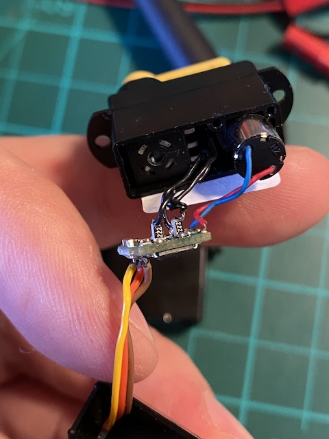

# Increase throw (deflection angle) of any servo

Common RC servo has throw of 45 degrees, each side (90 degrees total).
Some servos have total deflection of 120 or even 180 degrees, but they are usually expensive and/or hard to find.

And you generally want at least 180 degrees throw for pan (yaw) camera servo.

With this simple mod you can increase throw of any servo to any desired angle.
The idea is to tirck the servo contol circuit by increasing resistance of the servo potentiometer. 

Steps:
- Disassemble your servo;
- Locate potentiometer and measure resistance between its outer pins: `R0`;
- Calculate resistance `R1 = R0 * k`, there `k` is `0.6` to convert 90 deg servo to 180 deg servo;
- Theoretically by using larger `k` you can make your servo _almost_ 360 degrees, not tried though;
- Solder an extra `R1` resistor between servo control circuit and each of outer potentiometer pins;
- Done!

Picture shows two 2.2kOhm resistors soldered to 3.7kOhm potentiometer converting 90 degress servo to 180 degrees servo.

